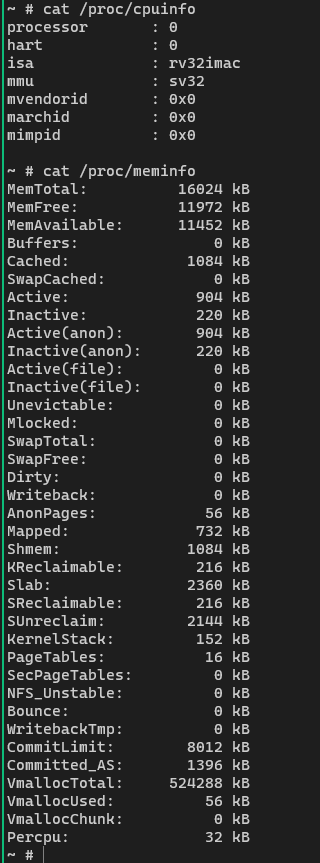

# RISC-V RV32IMAC SoC
## A From-Scratch Verilog CPU that Boots Linux

A solo-built RISC-V RV32IMAC system-on-chip written entirely in Verilog. 5-stage pipeline, Sv32 MMU with hardware page table walker, M/S/U privilege modes, and CLINT/PLIC/UART peripherals. Boots unmodified OpenSBI, Linux 6.1.25, and runs an interactive BusyBox shell.

~4,900 lines of Verilog | ~90 instructions | 40 CSRs | 17 source files


---

## Demo: Linux Boot to Shell

The CPU boots OpenSBI firmware, then the Linux kernel, and reaches an interactive BusyBox shell where commands can be executed. Full boot takes ~158M cycles (~10 minutes in Verilator).



*`cat /proc/cpuinfo` and `cat /proc/meminfo` running inside Linux on the CPU -- the kernel reports the ISA (`rv32imac`), MMU type (`sv32`), and 16MB of managed memory with active page tables, slab allocator, and virtual memory.*

<details>
<summary>Full boot log (click to expand)</summary>

```
OpenSBI v1.8.1
   ____                    _____ ____ _____
  / __ \                  / ____|  _ \_   _|
 | |  | |_ __   ___ _ __ | (___ | |_) || |
 | |  | | '_ \ / _ \ '_ \ \___ \|  _ < | |
 | |__| | |_) |  __/ | | |____) | |_) || |_
  \____/| .__/ \___|_| |_|_____/|____/_____|
        | |
        |_|

Platform Name               : Custom RV32IMA SoC
Platform HART Count         : 1
Boot HART ISA               : rv32ima
Boot HART MIDELEG           : 0x00000222
Boot HART MEDELEG           : 0x0000b109

[    0.000000] Linux version 6.1.25
[    0.000000] Machine model: Custom RV32IMA SoC
[    0.000000] earlycon: ns16550 at MMIO32 0x10000000 (options '115200n8')
[    0.000000] printk: bootconsole [ns16550] enabled
[    0.000000] SBI specification v3.0 detected
[    0.000000] riscv: base ISA extensions acim
[    0.000000] Built 1 zonelists, mobility grouping on.  Total pages: 8128
[    0.000000] riscv-intc: 32 local interrupts mapped
[    0.000000] plic: plic@c000000: mapped 31 interrupts with 1 handlers for 2 contexts.
[    0.000046] sched_clock: 64 bits at 10MHz, resolution 100ns
[   10.788198] 10000000.serial: ttyS0 at MMIO 0x10000000 (irq = 1) is a 16550A
[   10.990328] printk: console [ttyS0] enabled
[   12.779821] Freeing unused kernel image (initmem) memory: 4884K
[   12.789422] Run /init as init process

==================================
  RV32IMA Linux - Shell Ready!
==================================

~ #
```

</details>

---

## Features

### ISA Support

| Extension | Instructions | Description |
|-----------|-------------|-------------|
| **RV32I** | 40 | Base integer (ALU, load/store, branch, jump, CSR) |
| **M** | 8 | Multiply/divide (32-cycle iterative divider) |
| **A** | 11 | Atomics (LR/SC, AMO swap/add/and/or/xor/min/max) |
| **C** | ~25 | Compressed 16-bit instructions (RVC decompressor in IF stage) |
| **System** | 6 | ECALL, EBREAK, MRET, SRET, WFI, SFENCE.VMA |

### Privilege Modes

| Mode | Level | Usage |
|------|-------|-------|
| **M-mode** | 3 | OpenSBI firmware, full hardware access |
| **S-mode** | 1 | Linux kernel, MMU-translated memory |
| **U-mode** | 0 | User processes (BusyBox/init) |

### Memory Management (Sv32)

- Two-level page table: 10-bit VPN[1] + 10-bit VPN[0] + 12-bit offset
- 4KB pages and 4MB superpages
- Hardware page table walker with automatic A/D bit updates (Svadu)
- 16-entry fully-associative TLB with ASID tagging and LRU replacement
- SFENCE.VMA support for TLB invalidation
- CSR-to-MMU forwarding: SUM/MXR bits forwarded from WB-stage CSR writes
- MPRV support: M-mode data accesses use MPP privilege when MPRV=1

### Pipeline

- 5-stage: IF / ID / EX / MEM / WB
- Data forwarding (EX-to-EX, MEM-to-EX, store data forwarding)
- Load-use and CSR-use hazard detection with pipeline stalls
- RVC decompression in IF stage with spanning instruction support
- Branch resolution in MEM stage with full pipeline flush
- Trap/interrupt detection in MEM stage

### CSRs (40 registers)

Machine-mode (15): mstatus, mstatush, misa, medeleg, mideleg, mie, mtvec, mcounteren, mscratch, mepc, mcause, mtval, mip, mvendorid, marchid, mhartid

Supervisor-mode (10): sstatus, sie, stvec, scounteren, sscratch, sepc, scause, stval, sip, satp

Counters (6): cycle/cycleh, time/timeh, instret/instreth

Extensions (9): mcountinhibit, mcyclecfg/h, minstretcfg/h (Smcntrpmf), tselect, tdata1 (Sdtrig), mconfigptr

### Peripherals

- **CLINT**: 64-bit mtime counter, mtimecmp comparator, timer interrupts
- **PLIC**: 31 external interrupt sources, priority/threshold, claim/complete
- **UART**: NS16550-compatible, 16-byte FIFOs, hardware TX/RX serializer for FPGA

---

## Architecture

```
                    +----------------------------------+
                    |         RISC-V CPU (RV32IMAC)    |
                    |  +----+----+----+-----+----+     |
                    |  | IF | ID | EX | MEM | WB |     |
                    |  |RVC |    |ALU |MMU  |    |     |
                    |  |dec.|    |DIV |trap |    |     |
                    |  +----+----+----+-----+----+     |
                    |  |   CSR File   | CLINT | PLIC | |
                    +--------+-------------------------+
                             |
                      Memory Bus (32-bit)
                             |
              +--------------+--------------+
              |              |              |
        +-----+----+  +-----+----+  +------+-----+
        |   RAM    |  |   UART   |  | PTW Memory |
        | 0x80000000|  | 0x10000000|  |   Port     |
        +----------+  +----------+  +------------+
```

### Memory Map

| Address Range | Region | Description |
|--------------|--------|-------------|
| 0x02000000 | CLINT | Timer (mtime @ 0x0200BFF8, mtimecmp @ 0x02004000) |
| 0x0C000000 | PLIC | External interrupt controller (31 sources, 2 contexts) |
| 0x10000000 | UART | 16550-compatible serial (mmio32, 4-byte register spacing) |
| 0x80000000 | RAM | Main memory (36MB for Linux boot, configurable) |

---

## Source Files

### CPU Core

| File | Lines | Description |
|------|-------|-------------|
| `src/cpu.v` | 1413 | Main 5-stage pipeline with forwarding, MMU integration, CSR forwarding |
| `src/control_unit.v` | 185 | Instruction decoder: RV32IMAC + system instructions |
| `src/ALU.v` | 63 | 18 ALU operations (base + M extension) |
| `src/div_unit.v` | 129 | 32-cycle iterative restoring divider |
| `src/csr_file.v` | 678 | 40 CSR registers, M/S-mode trap handling, interrupt delegation |
| `src/decompressor.v` | 370 | RVC 16-bit to 32-bit instruction expansion |
| `src/reg_file.v` | 31 | 32-entry register file (x0 hardwired to 0) |
| `src/definitions.v` | 17 | ALU opcode definitions |

### MMU

| File | Lines | Description |
|------|-------|-------------|
| `src/mmu.v` | 410 | Sv32 MMU coordinator: TLB lookup, PTW arbitration, fault handling |
| `src/tlb.v` | 348 | 16-entry fully-associative TLB with ASID and superpage support |
| `src/page_table_walker.v` | 377 | Hardware 2-level Sv32 page table walker with A/D bit management |

### SoC

| File | Lines | Description |
|------|-------|-------------|
| `src/soc.v` | 233 | Top-level SoC: RAM, MMIO routing, dual-port memory |
| `src/uart.v` | 490 | 16550 UART with FIFOs and hardware TX/RX for FPGA |
| `src/clint.v` | 142 | CLINT timer unit |
| `src/plic.v` | 245 | PLIC interrupt controller |
| `src/atomic_unit.v` | 173 | LR/SC reservation tracking + AMO operations |

---

## Getting Started

### Prerequisites

- **Simulation**: [Icarus Verilog](http://iverilog.icarus.com/) or [Verilator](https://www.veripool.org/verilator/)
- **Waveforms**: [GTKWave](http://gtkwave.sourceforge.net/)
- **Linux build** (optional): Docker + RISC-V cross-compiler (see `Dockerfile`)

### Quick Test (Bare-Metal)

```bash
cd sim
iverilog -o test -g2005 -DSIMULATION soc_tb.v
vvp test
```

### Linux Boot (Verilator, recommended)

```bash
# Build the Verilator model (requires WSL or Linux with verilator installed)
cd sim
make -f Makefile.verilator

# Run — boots to shell in ~10 minutes
./obj_dir/Vsoc

# Or run with interactive UART (type commands after shell prompt)
./obj_dir/Vsoc -i
```

### Linux Boot (Icarus Verilog)

```bash
cd sim
iverilog -o linux_shell_test -g2005 linux_shell_tb.v
vvp linux_shell_test
# Note: takes several hours (~5M cycles per 3-4 minutes)
```

### Build Linux Kernel + Initramfs (Docker)

```bash
docker build -t riscv-toolchain .
docker run -it --rm \
  -v "$(pwd):/output" \
  -v riscv-build:/work \
  riscv-toolchain bash /output/scripts/build_all.sh
```

This produces `dts/fw_payload_earlycon.hex` containing OpenSBI + Linux kernel + BusyBox initramfs.

---

## Technical Challenges

Building a CPU that passes unit tests is straightforward. Getting one to boot a real operating system exposed a series of subtle correctness issues that don't appear in textbook pipeline designs. These were the hardest problems in the project.

### CSR-to-MMU Forwarding

**Problem**: After the kernel writes `csrs sstatus, SUM` to allow supervisor-mode access to user pages, the very next instruction would page fault. The CSR write was in the WB stage, but the MMU permission check happened in MEM -- one cycle before the write took effect.

**Solution**: Detect mstatus/sstatus writes in WB and forward the new SUM and MXR bits directly to the MMU, bypassing the CSR register file. This is analogous to ALU data forwarding but for control bits -- a case not covered in standard pipeline literature.

### Page Table Walker Arbitration Deadlock

**Problem**: During Linux boot, the kernel would freeze during page table setup. The MMU serves two clients: instruction fetch and data access. When a data access caused a page fault, the fault was latched in the MMU -- but this also blocked the instruction fetch PTW from ever starting, since the data fault flag prevented new walks.

**Solution**: Separate the fault-latching logic so that a data-side fault doesn't block the instruction-side PTW. Give data access priority (since it's typically from MEM stage and time-critical), but allow ifetch walks to proceed independently when the data path is idle.

### Wrong-Path Instruction Fetch Page Faults

**Problem**: When a branch in the MEM stage redirects the PC, instructions already in IF and ID are on the wrong path and will be flushed. But if one of those wrong-path fetches triggers a page fault, the CPU would take a spurious trap before the flush could take effect.

**Solution**: Suppress ifetch page faults when the MEM stage is about to redirect (branch taken, MRET, SRET, SFENCE.VMA). The flush signal takes priority over the fault.

### Compressed Instruction Spanning

**Problem**: RVC compressed instructions are 16 bits, but the memory bus is 32 bits wide. When PC[1]=1, a 32-bit instruction can start in the upper half of one word and end in the lower half of the next. The pipeline needs two fetches to reconstruct a single instruction, but only if it's actually a 32-bit instruction -- which you can't know until you see the first 16 bits.

**Solution**: A `saved_half` register captures the upper 16 bits when a potential span is detected. The next fetch concatenates the two halves. A `spanning_pc` register preserves the true instruction address since the PC has already advanced. This adds a 1-cycle bubble only for spanning instructions.

### Trap Handling During MMU Stalls

**Problem**: When the MMU stalls the pipeline (during a page table walk), the CSR trap logic was still processing interrupts. This corrupted the SPP (supervisor previous privilege) bit because the trap handler would fire while the pipeline was frozen, overwriting state that the stalled instruction still needed.

**Solution**: Gate all trap processing with `!mmu_stall`. The trap signal becomes `take_trap_effective = take_trap && !mmu_stall`, ensuring CSR state is only modified when the pipeline is actually flowing.

### CSR Write vs. Trap Priority

**Problem**: When a WB-stage CSR write and a MEM-stage trap occurred in the same cycle, the CSR write was silently dropped. The `if (trap_taken) ... else if (csr_write)` structure meant trap entry always won. This caused an infinite page fault loop: `csrs sstatus, SUM` (WB) + `lw` (MEM page fault) would repeatedly fault because SUM was never actually set.

**Solution**: Use separate `if` blocks instead of `if/else if`. CSR writes execute first, then trap entry overwrites only the conflicting bits (sepc, scause, etc.). Verilog's last-nonblocking-assignment-wins semantics ensure correct priority while preserving non-conflicting write effects.

### Store Page Fault Must Suppress Memory Write

**Problem**: When a store instruction hit a read-only page, the MMU correctly raised a store page fault, but the write data still reached RAM in the same cycle. The `mem_wstrb` (write byte-enable) signal was not gated by the page fault detection, so the store was committed to memory before the trap could prevent it. This corrupted the `__stack_chk_guard` canary in BusyBox, causing a stack protector SIGSEGV.

**Solution**: Add `&& !page_fault_data` to the `mem_wstrb` assignment. Faulting stores produce zero write strobes, matching real hardware behavior where a faulting store is never committed to memory.

---

## Linux Boot Details

### Boot Sequence

```
OpenSBI v1.8.1 (M-mode, 0x80000000)
  -> Relocation table applied (608 entries)
  -> Platform init: UART/CLINT/PLIC setup
  -> Jump to Linux (S-mode, 0x80400000)
    -> head.S: build page tables, enable Sv32 MMU
    -> First instruction page fault -> kernel virtual space (0xC0xxxxxx)
    -> DTB parse, memory init, driver init
    -> earlycon: ns16550 at MMIO32 0x10000000
    -> Initramfs extraction, /init -> BusyBox shell
```

### Boot Arguments

```
earlycon=ns16550,mmio32,0x10000000,115200n8 console=ttyS0,115200n8 loglevel=8 lpj=1000
```

### Kernel Virtual Address Mapping

- Physical 0x80000000 -> Virtual 0xC0000000 (offset 0x40000000)
- 4MB superpages for kernel linear mapping
- MMIO identity maps: UART (0x10000000), CLINT (0x02000000), PLIC (0x0C000000)

### Software Stack

| Component | Version | Mode | Description |
|-----------|---------|------|-------------|
| OpenSBI | v1.8.1 | M-mode | SBI firmware, hardware abstraction |
| Linux | 6.1.25 | S-mode | Kernel with earlycon, initramfs |
| BusyBox | - | U-mode | Minimal userspace with shell |

---

## FPGA Synthesis Support

The design is synthesis-ready:

- `ifdef SIMULATION` / `ifndef SYNTHESIS` guards on all simulation constructs
- Hardware UART TX/RX serializer (baud rate generator + shift registers)
- 32-cycle iterative divider (replaces combinational div for timing closure)

---

## Design Highlights

### Pipeline Stall Hierarchy

```
Reset -> Pipeline Flush -> MMU/Div Stall (frozen) -> Data Hazard Stall -> Normal
```

MMU stalls (page table walks, division) freeze the entire pipeline. Data hazard stalls (load-use, CSR-use) insert a bubble in ID/EX while letting later stages drain. Getting the priority right between these was critical -- a flush during an MMU stall must be deferred, not dropped.

### Iterative Divider

Division uses a 32-cycle restoring algorithm in `div_unit.v`. The divider stalls the pipeline via `div_stall` merged into the MMU stall signal. Special cases (divide-by-zero, signed overflow MIN_INT/-1) resolve in a single cycle per the RISC-V spec.

### MPRV (Modify Privilege)

When MPRV=1 in mstatus, M-mode data accesses use the privilege level in MPP instead of M-mode. This is how OpenSBI accesses S-mode memory on behalf of the kernel. The forwarding path must also cover MPRV/MPP bits, not just SUM/MXR, to avoid a 1-cycle window where the wrong privilege is used.

---

## Future Work

- **FPGA validation**: The design is synthesis-ready with simulation/synthesis guards, but needs a board-specific wrapper, constraints, and clock/memory configuration for any target FPGA.
- **Branch prediction**: The current design flushes on every taken branch (MEM-stage resolution). Even a simple BTB or static predict-backward scheme would measurably reduce CPI.
- **Instruction cache**: Currently all memory is single-cycle combinational. An I-cache with BRAM backing would enable higher clock frequencies on FPGA.
- **Multi-hart**: The CLINT and PLIC already support multi-hart structures, but the CPU is single-hart. Adding a second hart would exercise the atomic unit and enable true SMP Linux.

---

## Resources

- [RISC-V ISA Specifications](https://github.com/riscv/riscv-isa-manual/releases/latest) - Unprivileged (Vol 1) and Privileged (Vol 2)
- [Computer Organization and Design: RISC-V Edition](https://www.elsevier.com/books/computer-organization-and-design-risc-v-edition/patterson/978-0-12-812275-4) - Patterson & Hennessy

---

## License

This project is open source and available under the MIT License.
